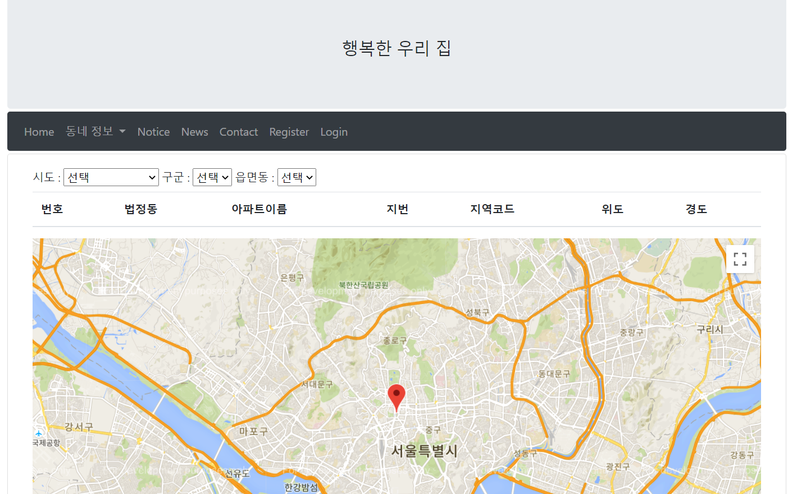

# `HappyHouse_Java_서울_09반_금아현_김민지_박채린_박형민_양영진_이지훈`

# 목표

# 제출

제출 내역은 다음과 같습니다.

- 기본
  - 메인 화면
  - 실거래가 검색, 결과 : 동별 검색 처리
  - 실거래가 검색, 결과 : 아파트별 검색 처리
  - 회원 관리 : 회원정보 등록,수정,삭제,목록조회,상세조회
  - 로그인 / 로그아웃
- 심화
  - 공지사항 관리 : 공지사항 등록,수정,삭제,목록조회,상세조회

# 캡쳐

**기본**

1. 메인화면

 

2. 실거래가 검색

.PNG)

3. 회원관리

4. 로그인/로그아웃

 

**심화** 

5. 공지사항

- 등록

- 검색

- 수정

삭제 전

.png)

삭제 후

.png)

## 공지사항

**DB**

- MySQL 5.1 사용

- happyhouse 데이터베이스에 article table을 추가했다. 관련 sql 파일은 /res/happyhouse_article.sql

**Model** 

- OpenJDK8 활용. 

- 자바 클래스 ArticleService, ArticleDao, ArticleDto를 이용해 모델을 구축했다.

**View**

- JSP의 EL/JSTL, Session 활용

- /Webcontent/article/ 에 있는 jsp 파일들을 이용해 공지사항 서비스의 View를 제공한다.

참고자료

http://happyhouse.jaen.kr/